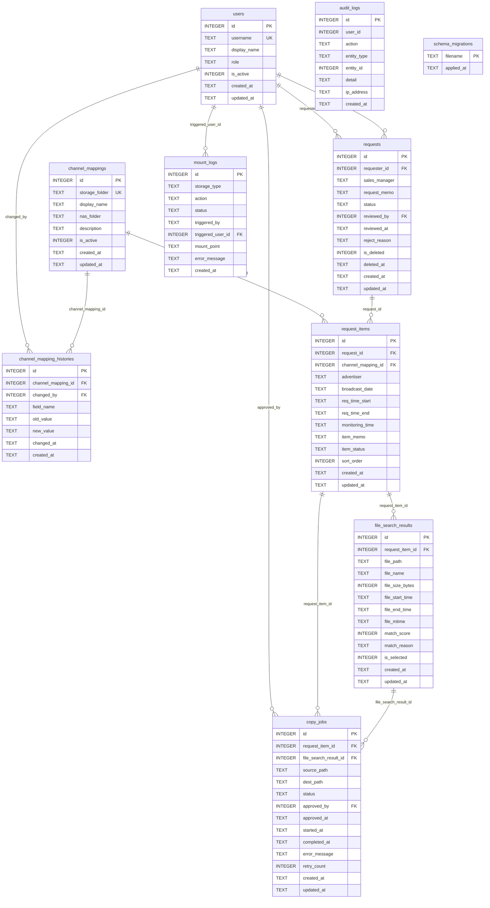

# DB 스키마 설계 문서

> 작성일: 2026-03-06
> 대상: MVP Phase 1
> DB: SQLite (better-sqlite3, WAL 모드, 외래키 ON)

---

## ERD 개요



---

## 엔티티 분류

| 분류 | 테이블 | 설명 |
|------|--------|------|
| Core | `users` | 사용자 — 거의 변하지 않는 핵심 엔티티 |
| Core | `channel_mappings` | 채널 매핑 — 시스템 기반 설정 |
| Core | `requests` | 요청 헤더 — 업무 흐름의 출발점 |
| Core | `request_items` | 요청 상세 행 — 실제 처리 단위 |
| Operation | `file_search_results` | 자동 탐색 결과 |
| Operation | `copy_jobs` | 복사 작업 추적 |
| Audit | `channel_mapping_histories` | 채널 매핑 변경 이력 |
| Audit | `mount_logs` | 마운트 이력 (보안 핵심) |
| Audit | `audit_logs` | 전체 행위 감사 로그 |
| System | `schema_migrations` | 마이그레이션 실행 이력 |

---

## 테이블 상세

### 1. users

**목적**: 광고팀, 기술팀, 관리자 사용자 계정 관리

| 컬럼 | 타입 | 제약 | 설명 |
|------|------|------|------|
| id | INTEGER | PK, AUTOINCREMENT | 내부 식별자 |
| username | TEXT | NOT NULL, UNIQUE | 로그인 ID (사내 계정명) |
| display_name | TEXT | NOT NULL | 화면 표시 이름 |
| role | TEXT | NOT NULL, CHECK | 역할: `ad_team` / `tech_team` / `admin` |
| is_active | INTEGER | NOT NULL, DEFAULT 1 | 활성 여부 (0=비활성) |
| created_at | TEXT | NOT NULL | 생성 일시 |
| updated_at | TEXT | NOT NULL | 수정 일시 |

**인덱스**:
| 인덱스명 | 컬럼 | 사유 |
|---------|------|------|
| idx_users_username | username | 로그인 시 조회 |
| idx_users_role | role | 역할별 목록 조회 |

**설계 노트**: 소프트 삭제 대신 `is_active=0`으로 비활성화. 삭제 시 요청 이력의 requester_id가 NULL이 되는 문제를 방지하기 위해 `ON DELETE RESTRICT` 정책 적용.

---

### 2. channel_mappings

**목적**: Logger Storage 폴더명 ↔ 화면 표시명 ↔ 공유 NAS 폴더명 매핑 관리

| 컬럼 | 타입 | 제약 | 설명 |
|------|------|------|------|
| id | INTEGER | PK, AUTOINCREMENT | 내부 식별자 |
| storage_folder | TEXT | NOT NULL, UNIQUE | Logger Storage 폴더명 (예: ETV) |
| display_name | TEXT | NOT NULL | 화면 표시 채널명 (예: 라이프) |
| nas_folder | TEXT | NOT NULL | 공유 NAS 복사 대상 폴더명 |
| description | TEXT | - | 채널 설명 (선택) |
| is_active | INTEGER | NOT NULL, DEFAULT 1 | 활성 여부 (폐채널 처리 시 0) |
| created_at | TEXT | NOT NULL | 생성 일시 |
| updated_at | TEXT | NOT NULL | 수정 일시 |

**초기 데이터** (002_seed_channel_mappings.sql):

| storage_folder | display_name | nas_folder |
|---------------|-------------|-----------|
| CNBC | 비즈 | 비즈 |
| ESPN | 스포츠 | 스포츠 |
| ETV | 라이프 | 라이프 |
| FIL | 퍼니 | 퍼니 |
| GOLF | 골프 | 골프 |
| NICK | 골프2 | 골프2 |
| PLUS | 플러스 | 플러스 |

**설계 노트**: `storage_folder`는 Logger Storage 경로 파싱의 기준. `display_name`은 채널명이 변경되어도 `storage_folder`만 바꾸면 기존 요청 이력이 보존됨. 변경 이력은 `channel_mapping_histories`에 별도 기록.

---

### 3. channel_mapping_histories

**목적**: 채널 매핑 변경 시 변경 전 값 기록 (감사 + 소급 추적)

| 컬럼 | 타입 | 제약 | 설명 |
|------|------|------|------|
| id | INTEGER | PK, AUTOINCREMENT | 내부 식별자 |
| channel_mapping_id | INTEGER | FK → channel_mappings | 변경된 채널 매핑 |
| changed_by | INTEGER | FK → users | 변경 수행 사용자 |
| field_name | TEXT | NOT NULL | 변경된 필드명 (예: display_name) |
| old_value | TEXT | - | 변경 전 값 |
| new_value | TEXT | - | 변경 후 값 |
| changed_at | TEXT | NOT NULL | 변경 일시 |
| created_at | TEXT | NOT NULL | 레코드 생성 일시 |

---

### 4. requests

**목적**: 광고 증빙 요청 헤더. 한 건의 요청에 복수의 request_items가 속함

**상태 흐름**:
```
pending → searching → search_done → approved → copying → done
                                └→ rejected
                   └→ failed (탐색 실패)
```

| 컬럼 | 타입 | 제약 | 설명 |
|------|------|------|------|
| id | INTEGER | PK | 내부 식별자 |
| requester_id | INTEGER | FK → users, NOT NULL | 요청자 |
| sales_manager | TEXT | NOT NULL | 영업담당자 이름 |
| request_memo | TEXT | - | 전체 비고 |
| status | TEXT | NOT NULL, CHECK | 요청 전체 상태 |
| reviewed_by | INTEGER | FK → users | 검토/승인 기술팀 사용자 |
| reviewed_at | TEXT | - | 검토 일시 |
| reject_reason | TEXT | - | 반려 사유 |
| is_deleted | INTEGER | NOT NULL, DEFAULT 0 | 소프트 삭제 플래그 |
| deleted_at | TEXT | - | 삭제 일시 |
| created_at | TEXT | NOT NULL | 생성 일시 |
| updated_at | TEXT | NOT NULL | 수정 일시 |

**설계 노트**: `requests.status`는 전체 요청의 대표 상태. 개별 항목 처리 상태는 `request_items.item_status` 기준. 전체 status는 앱 레벨에서 items 상태를 집계하여 동기화.

---

### 5. request_items

**목적**: 요청의 개별 처리 단위. 채널 + 광고주 + 방송일 + 시간대 조합 1건

| 컬럼 | 타입 | 제약 | 설명 |
|------|------|------|------|
| id | INTEGER | PK | 내부 식별자 |
| request_id | INTEGER | FK → requests, NOT NULL | 소속 요청 |
| channel_mapping_id | INTEGER | FK → channel_mappings, NOT NULL | 채널 |
| advertiser | TEXT | NOT NULL | 광고주명 |
| broadcast_date | TEXT | NOT NULL | 방송일자 (YYYY-MM-DD) |
| req_time_start | TEXT | NOT NULL | 요청 시간대 시작 (HH:MM) |
| req_time_end | TEXT | NOT NULL | 요청 시간대 종료 (HH:MM) |
| monitoring_time | TEXT | NOT NULL | 모니터링 송출 시간 (HH:MM 또는 HH:MM:SS) |
| item_memo | TEXT | - | 항목별 메모 |
| item_status | TEXT | NOT NULL, CHECK | 개별 처리 상태 |
| sort_order | INTEGER | NOT NULL, DEFAULT 0 | 화면 표시 순서 |
| created_at | TEXT | NOT NULL | 생성 일시 |
| updated_at | TEXT | NOT NULL | 수정 일시 |

---

### 6. file_search_results

**목적**: 자동 파일 탐색 결과 저장. 기술팀 검토 후 최종 파일 선택

| 컬럼 | 타입 | 제약 | 설명 |
|------|------|------|------|
| id | INTEGER | PK | 내부 식별자 |
| request_item_id | INTEGER | FK → request_items, NOT NULL | 대상 요청 항목 |
| file_path | TEXT | NOT NULL | 원본 파일 절대 경로 |
| file_name | TEXT | NOT NULL | 파일명 |
| file_size_bytes | INTEGER | - | 파일 크기 (bytes) |
| file_start_time | TEXT | - | 파일명 파싱 기준 시작 시각 |
| file_end_time | TEXT | - | 파일명 파싱 기준 종료 시각 (약 1시간5분 후) |
| file_mtime | TEXT | - | OS 파일 수정 시각 |
| match_score | INTEGER | NOT NULL, CHECK(0~100) | 매칭 신뢰도 |
| match_reason | TEXT | - | 매칭 근거 (기술팀 검토용) |
| is_selected | INTEGER | NOT NULL, DEFAULT 0 | 최종 선택 여부 |
| created_at | TEXT | NOT NULL | 생성 일시 |
| updated_at | TEXT | NOT NULL | 수정 일시 |

**설계 노트**: 파일명 패턴 `{채널}_{YYYYMMDD}_{HHMMSS}_{HHMM}.avi`에서 시작/종료 시각 파싱. 1시간 5분 단위 파일이므로 요청 시간대와 정확히 1:1 매칭되지 않을 수 있음 → `match_score`로 정확도 표시, 기술팀 최종 확인 필수.

---

### 7. copy_jobs

**목적**: 파일 복사 작업 추적. 한 request_item 당 copy_job 1건

| 컬럼 | 타입 | 제약 | 설명 |
|------|------|------|------|
| id | INTEGER | PK | 내부 식별자 |
| request_item_id | INTEGER | FK → request_items, NOT NULL | 대상 요청 항목 |
| file_search_result_id | INTEGER | FK → file_search_results, NOT NULL | 선택된 파일 |
| source_path | TEXT | NOT NULL | 복사 원본 (Logger Storage) |
| dest_path | TEXT | NOT NULL | 복사 대상 (공유 NAS) |
| status | TEXT | NOT NULL, CHECK | 작업 상태 |
| approved_by | INTEGER | FK → users | 승인한 기술팀 사용자 |
| approved_at | TEXT | - | 승인 일시 |
| started_at | TEXT | - | 복사 시작 일시 |
| completed_at | TEXT | - | 복사 완료 일시 |
| error_message | TEXT | - | 실패 원인 메시지 |
| retry_count | INTEGER | NOT NULL, DEFAULT 0 | 재시도 횟수 |
| created_at | TEXT | NOT NULL | 생성 일시 |
| updated_at | TEXT | NOT NULL | 수정 일시 |

**중복 복사 방지**: `status='done'`인 copy_job이 이미 있는 request_item_id에 대해 새 job 생성을 애플리케이션 레벨에서 차단.

---

### 8. mount_logs

**목적**: 스토리지 마운트/언마운트 이력 (보안 핵심 기능)

| 컬럼 | 타입 | 제약 | 설명 |
|------|------|------|------|
| id | INTEGER | PK | 내부 식별자 |
| storage_type | TEXT | NOT NULL, CHECK | `logger_storage` / `shared_nas` |
| action | TEXT | NOT NULL, CHECK | `mount` / `unmount` |
| status | TEXT | NOT NULL, CHECK | `success` / `failed` |
| triggered_by | TEXT | NOT NULL, CHECK | `startup` / `shutdown` / `admin` / `system` |
| triggered_user_id | INTEGER | FK → users | 관리자 수동 조작 시 사용자 ID |
| mount_point | TEXT | - | 마운트 경로 |
| error_message | TEXT | - | 실패 시 오류 메시지 |
| created_at | TEXT | NOT NULL | 이력 생성 일시 |

**설계 노트**: `updated_at` 없음 — 마운트 이력은 불변(Immutable). 현재 마운트 상태는 `storage_type`별 최신 레코드의 `action`과 `status`로 판단.

---

### 9. audit_logs

**목적**: 시스템 내 주요 행위 전체 감사 로그

| 컬럼 | 타입 | 제약 | 설명 |
|------|------|------|------|
| id | INTEGER | PK | 내부 식별자 |
| user_id | INTEGER | - | 행위자 ID (NULL=시스템 자동) |
| action | TEXT | NOT NULL | 행위 코드 (아래 목록 참조) |
| entity_type | TEXT | - | 대상 엔티티 종류 |
| entity_id | INTEGER | - | 대상 엔티티 ID (느슨한 참조) |
| detail | TEXT | - | 추가 정보 (JSON 권장) |
| ip_address | TEXT | - | 요청 IP |
| created_at | TEXT | NOT NULL | 로그 생성 일시 |

**action 코드 목록**:
| action | 설명 |
|--------|------|
| request_create | 요청 등록 |
| request_approve | 요청 승인 |
| request_reject | 요청 반려 |
| search_start | 파일 탐색 시작 |
| search_done | 파일 탐색 완료 |
| search_failed | 파일 탐색 실패 |
| copy_approve | 복사 승인 |
| copy_start | 복사 시작 |
| copy_done | 복사 완료 |
| copy_failed | 복사 실패 |
| channel_mapping_update | 채널 매핑 변경 |
| mount_execute | 마운트 실행 |
| unmount_execute | 언마운트 실행 |
| user_login | 로그인 |
| user_logout | 로그아웃 |
| user_create | 사용자 생성 |
| user_deactivate | 사용자 비활성화 |

**설계 노트**: `entity_type` + `entity_id`는 외래키 없는 느슨한 참조. 엔티티 삭제 후에도 감사 로그는 보존. 조회 시 LEFT JOIN 사용.

---

## 무결성 규칙 (DB 레벨)

| 규칙 | 방법 |
|------|------|
| role은 세 가지 값만 허용 | CHECK constraint |
| is_active는 0 또는 1 | CHECK constraint |
| status 값은 허용 목록 내 | CHECK constraint |
| match_score는 0~100 | CHECK constraint |
| 외래키 참조 무결성 | FOREIGN KEY + `pragma foreign_keys = ON` |
| 채널 매핑 storage_folder 중복 불가 | UNIQUE constraint |
| 사용자 username 중복 불가 | UNIQUE constraint |

---

## 확장 포인트

| 미래 기능 | 확장 방법 |
|----------|---------|
| 요청 템플릿 저장 | `request_templates`, `request_template_items` 테이블 추가 |
| 광고 구간 추출 | `clip_jobs` 테이블 추가 (copy_jobs와 유사 구조) |
| 시청률 연동 | `rating_data` 테이블 추가 (request_items와 1:1) |
| 알림 기능 | `notifications` 테이블 추가 (user_id, type, message) |
| 통계/리포트 | 별도 뷰(VIEW) 또는 집계 테이블 추가 |
| 다중 파일 선택 | `file_search_results.is_selected` → 복수 선택 지원 시 copy_jobs 1:N 구조로 변경 |

---

## 마이그레이션 파일 목록

| 파일명 | 내용 |
|--------|------|
| `001_initial_schema.sql` | 전체 테이블 및 인덱스 생성 |
| `002_seed_channel_mappings.sql` | 초기 채널 매핑 7건 삽입 |

**새 마이그레이션 추가 방법**: `backend/src/config/migrations/`에 `NNN_설명.sql` 형식으로 추가. 서버 재기동 시 자동 적용.
